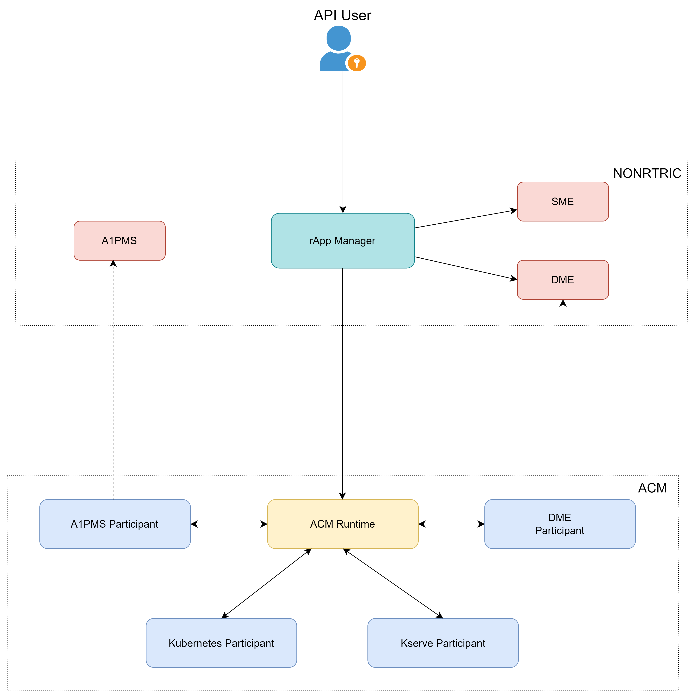
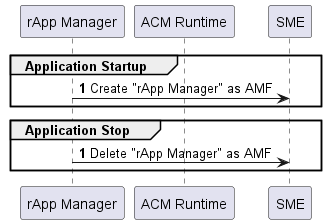

# Rapp Manager (This is a prototype)
Rapp manager is an application which lifecycle manages the Rapp.

<mark>**Rapp packaging model used here is purely a prototype**</mark>

## Architecture



### Rapp States


### Rapp Instance States


### Events responsible for Rapp Instance State Transition


## Integrations

### ONAP ACM

ONAP ACM is used here as a backend of Rapp manager to lifecycle manage the deployment items as part of Rapp.

ONAP ACM related details can be found [here](https://docs.onap.org/projects/onap-policy-parent/en/london/clamp/clamp.html).


### Integration of SME (CAPIF)

This integration is based on the CAPIF function developed as part of ORAN-SC. It is available [here](https://github.com/o-ran-sc/nonrtric-plt-sme/blob/master/capifcore/README.md)

## Flow Diagrams

### Application Lifecycle



### Rapp Flow


### Rapp Instance Flow


## Maven Build

This build supports Linux and Windows environments.

In case of below error during the build in Windows environment,

```
[INFO] --- exec-maven-plugin:3.1.0:exec (git submodule update) @ rapp-manager-sme ---
C:/Program Files/Git/mingw64/libexec/git-core\git-submodule: line 7: basename: command not found
C:/Program Files/Git/mingw64/libexec/git-core\git-submodule: line 7: sed: command not found
C:/Program Files/Git/mingw64/libexec/git-core\git-submodule: line 22: .: git-sh-setup: file not found
```

It is necessary to append additional paths listed below to the <strong>System</strong> environment variable
named "<strong>PATH</strong>". These paths can vary based on the git installation location.

```
C:\Program Files\Git\usr\bin
C:\Program Files\Git\mingw64\libexec\git-core
```
