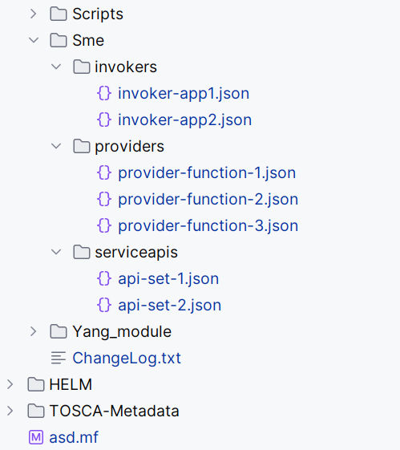
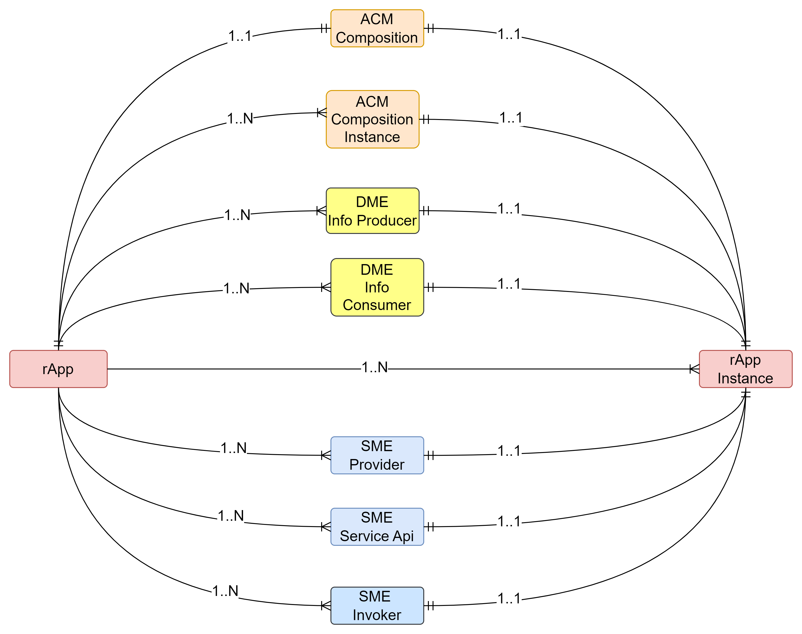
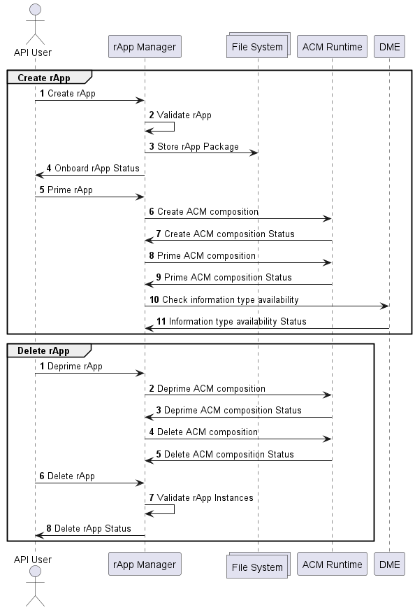
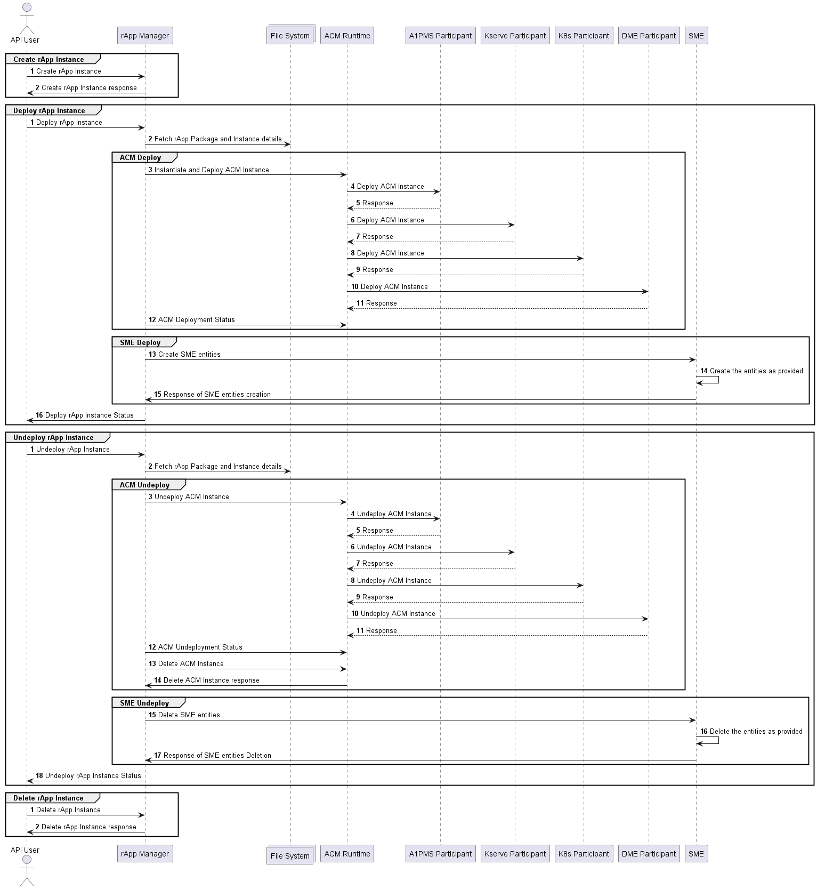

# rApp Manager (Experimental O-RAN-SC Module)


> [!WARNING]
> This repository is pre-spec and not intended for production use. No CVE remediation or production guarantees apply.

rApp manager is an application which lifecycle manages the rApp.

<mark>**rApp packaging model used here is purely a prototype**</mark>

## Architecture


### rApp Package (<mark>**It is a prototype**</mark>)




### rApp States


### rApp Instance States


### Events responsible for rApp Instance State Transition


### rApp Entity Relationship



## Integrations

### ONAP ACM

ONAP ACM is used here as a backend of rApp manager to lifecycle manage the deployment items as part of rApp.

ONAP ACM related details can be found [here](https://docs.onap.org/projects/onap-policy-parent/en/london/clamp/clamp.html).


### Integration of SME (Service Manager)

This integration is based on the Service Manager function developed as part of O-RAN SC. It is available [here](https://github.com/o-ran-sc/nonrtric-plt-sme/blob/master/servicemanager/README.md)

### Integration of DME (ICS)

This integration is based on the ICS as part of O-RAN SC NONRTRIC. It is available [here](https://docs.o-ran-sc.org/projects/o-ran-sc-nonrtric/en/latest/overview.html#information-coordination-service)

## Flow Diagrams

### Application Lifecycle


### rApp Flow



### rApp Instance Flow




## Maven Build

This build supports Linux and Windows environments.

In case of below error during the build in Windows environment:

```
[INFO] --- exec-maven-plugin:3.1.0:exec (git submodule update) @ rapp-manager-sme ---
C:/Program Files/Git/mingw64/libexec/git-core\git-submodule: line 7: basename: command not found
C:/Program Files/Git/mingw64/libexec/git-core\git-submodule: line 7: sed: command not found
C:/Program Files/Git/mingw64/libexec/git-core\git-submodule: line 22: .: git-sh-setup: file not found
```

It is necessary to append additional paths listed below to the <strong>System</strong> environment variable
named "<strong>PATH</strong>". These paths can vary based on the git installation location.

```
C:\Program Files\Git\usr\bin
C:\Program Files\Git\mingw64\libexec\git-core
```
