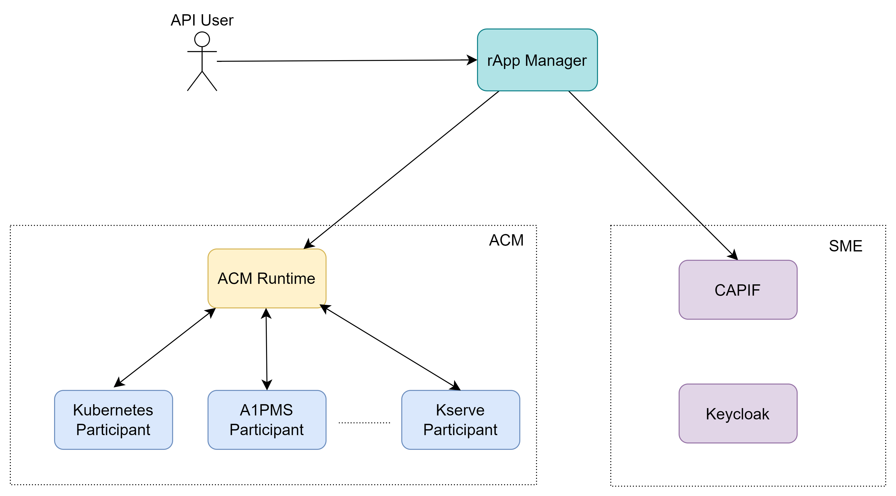
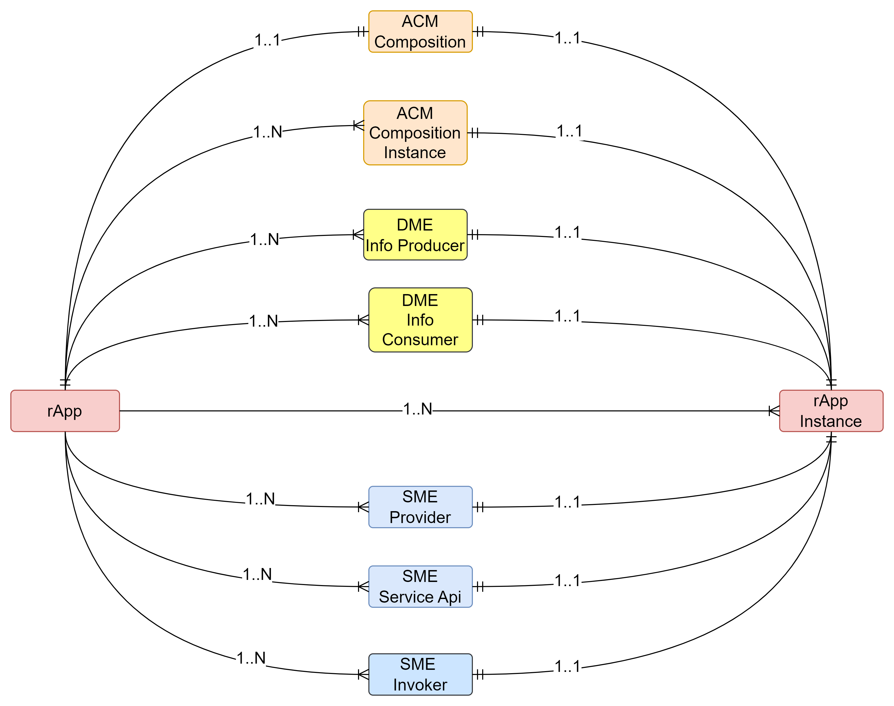

.. This work is licensed under a Creative Commons Attribution 4.0 International License.
.. SPDX-License-Identifier: CC-BY-4.0
.. Copyright (C) 2023-2025 OpenInfra Foundation Europe. All rights reserved.

rApp Manager
~~~~~~~~~~~~

The rApp Manager is a lifecycle management service for rApps. It gets the rApp as an ASD formatted package and lifecycle manages it based on it instance configuration. It uses ONAP ACM for lifecycle management operations and it integrates with other components for managing the rApp.

The ASD package contains the details required to create and integrate the required services/components.
The ASD package contains only one rApp and one rApp can have any number of rApp instances.

This product is a part of :doc:`NONRTRIC <nonrtric:index>`.

************
Architecture
************

**********
Data Model
**********

************
Integrations
************

The rApp Manager is integrated with the following components to support lifecycle managing the rApp.

ACM
---
Automation Composition Management (ACM) is a framework that supports Life Cycle Management of Automation Compositions. It supports deployment, monitoring, update and removal of Automation Compositions en-bloc, allowing users to manage their features, services, and capabilities as single logical units.
More details about ACM can be found in `ACM <https://docs.onap.org/projects/onap-policy-parent/en/latest/clamp/acm/acm-architecture.html#introduction>`_.

ACM-R has the ability to support an unlimited number of participants and all the participants can be configured through the configuration in the rApp package.

List of participants used by rApp manager sample rApp.

* `A1PMS Participant <https://docs.onap.org/projects/onap-policy-parent/en/latest/clamp/acm/design-impl/participants/a1pms-participant.html>`_ - It interacts with A1PMS of NONRTRIC. It is capable of lifecycle managing A1PMS service.
* `Kserve Participant <https://docs.onap.org/projects/onap-policy-parent/en/latest/clamp/acm/design-impl/participants/kserve-participant.html>`_ - It interacts with Kserve. It is capable of lifecycle managing Kserve inference service.
* `Kubernetes Participant <https://docs.onap.org/projects/onap-policy-parent/en/latest/clamp/acm/design-impl/participants/k8s-participant.html>`_ - It interacts with Helm/Kubernetes. It is capable of lifecycle managing Helm charts. It expects the helm charts to be available in the mentioned repository as it doesn't handle the helm chart creation in the chart repository.
* :doc:`DME Participant <participants:index>` -  It interacts with DME(ICS) of NONRTRIC. It is capable of lifecycle managing DME entities.

ACM composition and instance details can be provided as part of the rApp package and the package structure can be found in `Sample rApp package structure`_.

DME
---
The DME(Information Coordination Service (ICS)) is a generic service that maintains data subscriptions. Its main purpose is to decouple data consumers and data producers in a multi-vendor environment. A data consumer does not need to know anything about the producers of the data.
More details about DME can be found in `ICS <https://docs.o-ran-sc.org/projects/o-ran-sc-nonrtric-plt-informationcoordinatorservice/en/latest/overview.html>`_.

It is integrated with rApp manager to enable the rApp to produce/consume specific type of data(Information Type in DME terms).

Information type, and Data producer/consumer information can be provided as part of rApp package and the package structure can be found in `Sample rApp package structure`_.

SME
---
Service Manager is a Go implementation of a service that wraps the CAPIF Core function. When publishing a service it also creates a Kong route and Kong service.

The CAPIF stands for Common API framework and it was developed by 3GPP to enable a unified Northbound API framework across 3GPP network functions, and to ensure that there is a single and harmonized approach for API development.
More details about SME can be found in `SME <https://docs.o-ran-sc.org/projects/o-ran-sc-nonrtric-plt-sme/en/latest/overview.html>`_.

Service Manager is integrated with rApp manager to enable the rApp to expose/access/discover endpoints.

Service exposure/access related configurations can be provided as part of rApp package and the package structure can be found in `Sample rApp package structure`_.

*****************************
Sample rApp package structure
*****************************

.. warning::
    This packaging structure is a prototype and subject to change

The sample rApp package structure shown below and the location of relevant files for each integration is provided.

.. list-table::

    * - * ACM (Files/Acm)
            * Definition - Files/Acm/Definition (Only one file)
            * Instances - Files/Acm/instances
        * DME (Files/Dme)
            * Consumer Information Types - Files/Dme/consumerinfotypes
            * Producer information Types -  Files/Dme/producerinfotypes
            * Information Consumers - Files/Dme/infoconsumers
            * Information Producers - Files/Dme/infoproducers
        * SME (Files/Sme)
            * Providers Functions - Files/Sme/providers
            * Service Api -  Files/Sme/serviceapis
            * Invokers - Files/Sme/invokers
      - .. figure:: ./images/rApp-package-1.png
           :width: 200pt
        .. figure:: ./images/rApp-package-2.png
           :width: 150pt

**************
Implementation
**************

Implemented as a Java Spring Boot application.

*************
Configuration
*************

The component is configured by the usual Spring Boot application.yaml file.

An example application.yaml configuration file: ':download:`link <../rapp-manager-application/src/main/resources/application.yaml>`'

