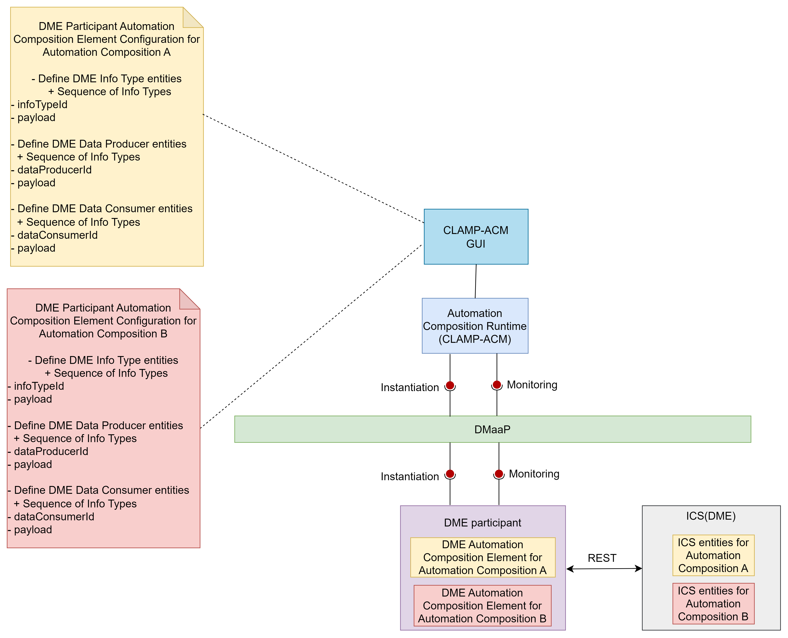

.. This work is licensed under a Creative Commons Attribution 4.0 International License.
.. SPDX-License-Identifier: CC-BY-4.0
.. Copyright (C) 2023-2025 OpenInfra Foundation Europe. All rights reserved.

DME Participant
~~~~~~~~~~~~~~~

A Participant is a component that acts as a bridge between the Automation Composition Management runtime and components such as the Kserve, A1PMS, DME, or a Kubernetes cluster that are taking part in automation composition management. It listens to DMaaP to receive messages from the ACM runtime and performs operations towards components that are taking part in acms. A participant has an Automation Composition Management Element for each automation composition in which it is taking part.

More information about ACM can be found `here <https://docs.onap.org/projects/onap-policy-parent/en/latest/clamp/acm/acm-architecture.html#introduction>`_.

The DME participant receives Information Type/Data Producer/Data Consumer information from the ACM runtime and creates it in ICS(NONRTRIC). The participant acts as a wrapper around the ICS and creates the entities.

Supported message Broker are DMaap and Strimzi-Kafka.

This participant is a part of :doc:`NONRTRIC <nonrtric:index>`.

************
Architecture
************

When an automation composition is initialized, the DME participant starts a DME Automation Composition element for the automation composition. It reads the configuration information sent from the Automation Composition Runtime and runs a REST client to talk to the ICS(DME) endpoint receiving the REST requests.

***************************************
Prerequisites for using DME participant
***************************************

* A running ICS(DME). ICS(DME) base url should be configured in DME participant to make REST calls.

***********************
Supported Element Types
***********************
Supported Element Types for DME participant will be used to define the DME participant Element Definition Types in tosca template. Participant Supported Element Types is defined in DME participant application.yaml.

      .. code-block:: yaml

        participantSupportedElementTypes:
          -
            typeName: org.onap.policy.clamp.acm.DMEAutomationCompositionElement
            typeVersion: 1.0.1

**************************************************
Defining a TOSCA CL definition for DME participant
**************************************************

A Info Type Entity/ Data Producer Entity/Data Consumer Entity describes a information type entities that is managed by the DME participant. A Info Type Entity/Data Producer Entity/Data Consumer Entity can be created, Read and Deleted. The user defines the entities that it wants its DME Automation Composition Element to manage and provides the parameters to manage each Information Type/Data Producer/Data Consumer.

Sample tosca template defining a participant and a AC element definition ':download:`link <./tosca-dme-participant.yml>`'

**************************************************************************************************
Configuring a Automation Composition Element on the DME participant for a Automation Composition
**************************************************************************************************

The user defines the following properties in the TOSCA template for the DME participant

*Information Type Entities*

.. list-table::
   :header-rows: 1

   * - Property
     - Type
     - Description
   * - infoTypeEntityId
     - ToscaConceptIdentifier
     - The name and version of the information type that needs to be managed by the DME participant
   * - infoTypeId
     - String
     - Id of information type
   * - payload
     - String
     - The payload of the information type entity. This will be used as  payload to call DME API

*Data Producer Entities*

.. list-table::
   :header-rows: 1

   * - Property
     - Type
     - Description
   * - dataProducerEntityId
     - ToscaConceptIdentifier
     - The name and version of the data producer that needs to be managed by the DME participant
   * - dataProducerId
     - String
     - Id of the data producer
   * - payload
     - String
     - The payload of the data producer entity. This will be used as  payload to call DME API

*Data Consumer Entities*

.. list-table::
   :header-rows: 1

   * - Property
     - Type
     - Description
   * - dataConsumerEntityId
     - ToscaConceptIdentifier
     - The name and version of the data consumer that needs to be managed by the DME participant
   * - dataConsumerId
     - String
     - Id of the data consumer
   * - payload
     - String
     - The payload of the data consumer entity. This will be used as  payload to call DME API

Sample Automation Composition instances. In that example the user fills the properties defined in the TOSCA for the DME participant ':download:`link <./automation-composition-dme.yml>`'

****************************
DME participant Interactions
****************************

The DME participant interacts with Automation Composition Runtime on the northbound interface via Message Broker. It interacts with the ICS(DME) API on the southbound interface for the operations.

The communication for the Automation Composition updates and state change requests are sent from the Automation Composition Runtime to the participant via Message Broker. The participant performs appropriate operations on DME via REST based on the received messages from the Automation Composition Runtime.

************************
DME participant Workflow
************************
Once the participant is started, it sends a “REGISTER” event to the Message Broker topic which is then consumed by the Automation Composition Runtime to register this participant on the runtime database. The user can commission the tosca definitions from the Policy Gui to the Automation Composition Runtime. Once the automation composition definitions are available in the runtime database, the user can prime them and further updates the participant with these definitions via Message Broker. After priming, the Automation Composition can be instantiated with the default state “UNDEPLOYED” from the Policy Gui.

When the state of the Automation Composition is changed from “UNDEPLOYED” to “DEPLOYED” from the Policy Gui, the DME participant receives the automation composition state change event from the runtime and deploys the information type/data producer/data consumer associated with each Automation Composition Elements by calling the ICS(DME) api in the cluster.

When the state of the Automation Composition is changed back from “DEPLOYED” to “UNDEPLOYED”, the participant also undeploys the related information type/data producer/data consumer from DME.
