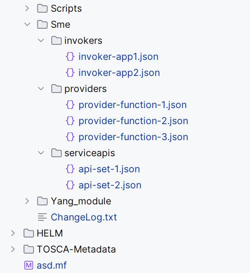

# Sample rApp Generator
The rApp generator supports generating the rApp package from the resources.

### Sample rApp Package Structure (<mark>**It is a prototype**</mark>)

This is a sample structure, and rApp package contents can be placed depending on the requirements of rApp.

### Generate rApp package

rApp package generator script takes the directory name as an argument and generates the rApp package with the contents inside the given directory.

#### Generating in Linux environment

> ./generate.sh rapp-all

#### Generating in Windows environment

> generate.bat rapp-all

This should generate rApp package named after the directory with the extension of .csar(e.g., rapp-all.csar) and it is placed parallel to the script.

